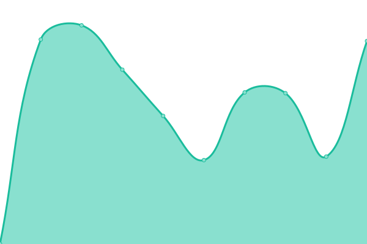

# [📈 Live Status](https://alekssobolewski.github.io): <!--live status--> **🟧 Partial outage**

This repository contains the open-source uptime monitor and status page for [Upptime](https://upptime.js.org), powered by [Upptime](https://github.com/upptime/upptime).

With [Upptime](https://upptime.js.org), you can get your own unlimited and free uptime monitor and status page, powered entirely by a GitHub repository. We use [Issues](https://github.com/upptime/upptime/issues) as incident reports, [Actions](https://github.com/upptime/upptime/actions) as uptime monitors, and [Pages](https://alekssobolewski.github.io) for the status page.

<!--start: status pages-->
<!-- This summary is generated by Upptime (https://github.com/upptime/upptime) -->
<!-- Do not edit this manually, your changes will be overwritten -->
<!-- prettier-ignore -->
| URL | Status | History | Response Time | Uptime |
| --- | ------ | ------- | ------------- | ------ |
|  [AreneScientific.com](https://arenescientific.com) | 🟥 Down | [arene-scientific-com.yml](https://github.com/alekssobolewski/h23/commits/HEAD/history/arene-scientific-com.yml) | 

 130ms
     
 | 

<a href="https://alekssobolewski.github.io/history/arene-scientific-com">3.19%</a>
    

|  [h23](https://h23.seohost.pl:2222/) | 🟩 Up | [h23.yml](https://github.com/alekssobolewski/h23/commits/HEAD/history/h23.yml) | 

 602ms
     
 | 

<a href="https://alekssobolewski.github.io/history/h23">100.00%</a>
    

<!--end: status pages-->

[**Visit our status website →**](https://alekssobolewski.github.io)

## 📄 License

- Powered by: [Upptime](https://github.com/upptime/upptime)
- Code: [MIT](./LICENSE) © [Upptime](https://upptime.js.org)
- Data in the `./history` directory: [Open Database License](https://opendatacommons.org/licenses/odbl/1-0/)
